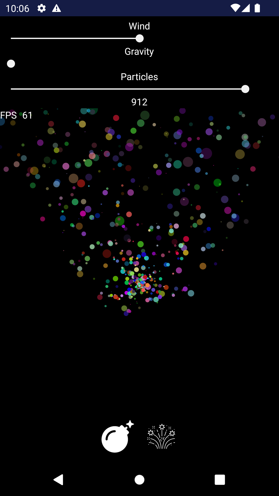
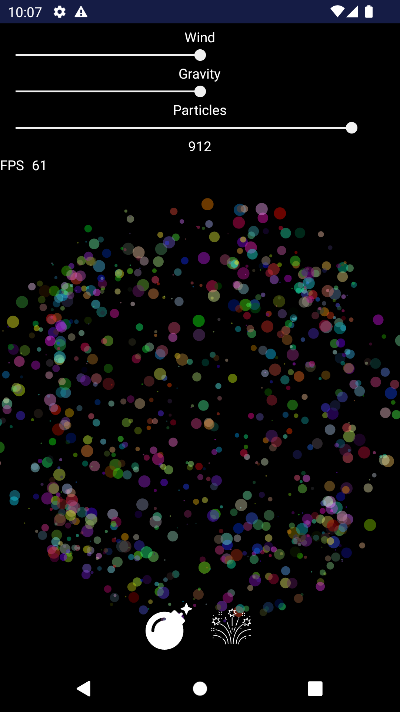

# AndroidParticleSystem

Sample particle engine for Android, with an UI to manipulate gravity, wind and particle number.
 

<table>
<tr>
    <td><h3>Emitter</h3></td>
    <td><h3>Explosion</h3></td>
</tr>
<tr>
    <td> </td>
    <td> </td>
</tr>
</table>

